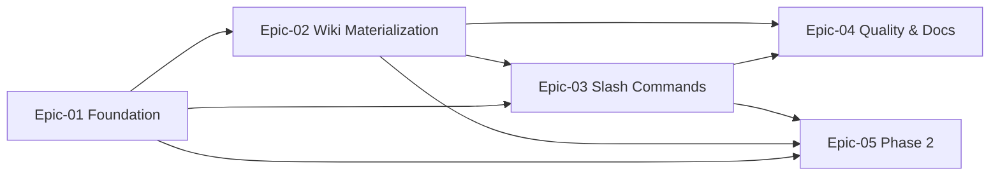

# USER STORIES — ai-research

> Generated by `/generate-epics` on 2026-04-14 from `REQUIREMENTS.md`.
> **Single source of truth** for all story definitions, progress tracking, and acceptance criteria: `docs/stories/`.

---

## User Personas

### Primary Persona

#### FX — Solo Researcher / Senior Engineer
- **Role**: Power user. Reads papers, blog posts, transcripts; synthesizes across sources.
- **Goals**: Durable, cross-linked knowledge that compounds. Ask questions against the wiki instead of re-reading sources. Validate Karpathy's LLM-Wiki premise on a real personal corpus.
- **Pain Points**: Sources pile up without synthesis; manual Obsidian notes decay; stateless RAG scripts re-derive context every query.

### Secondary Persona (implicit)

#### Future-FX / Open-Source Reader
- **Role**: Consumer of the resulting vault + a future OSS user.
- **Goals**: Open `wiki/` in Obsidian with zero tooling. Trust the pages without always auditing sources.

---

## Epic Overview

| Epic ID | Epic Name | Business Value | Story Count | Total Points | Priority |
|---------|-----------|----------------|-------------|--------------|----------|
| Epic-01 | Foundation & Python Toolkit | Deterministic file-ops core that slash commands compose. Enables everything downstream. | 9 | 19 | MVP (P0) |
| Epic-02 | Wiki Materialization & Indexing | Atomic page writes, idempotency, concept stubs, retrieval index. | 6 | 16 | MVP (P0) |
| Epic-03 | Claude Code Slash Commands | Product surface — interactive, `/loop`, and headless `claude -p` parity. | 6 | 17 | MVP (P0) |
| Epic-04 | Quality, Obsidian Compat & Docs | Golden tests, vault lint, README; shippable v1. | 5 | 11 | MVP (P0) |
| Epic-05 | Phase 2 — YouTube, Contradictions, Ops | Post-MVP depth: transcripts, contradiction detection, status, background watcher. | 6 | 17 | P1 |
| Epic-06 | MCP Server for Claude Desktop | Read-only MCP tools (`ask`, `search`, `list_pages`, `get_page`) so Claude Desktop can query the vault over stdio. | 8 | 19 | P1 |
| Epic-07 | Archive-After-Ingest | Drain `wiki/raw/` to `sources/` on materialize; state.json tracks archive path. | 6 | 15 | P1 |
| Epic-08 | Dual Source Links | `## Sources` renders both URL and local archive path; retroactive rewrite verb. | 4 | 11 | P1 |
| NFR | Non-Functional Requirements | Performance, privacy, reliability, scriptability envelopes. | 5 | 8 | MVP / P1 |

---

## Epic Navigation

- **[Epic-01: Foundation & Python Toolkit](./stories/epic-01-foundation-toolkit.md)** — `pyproject`, Typer skeleton, state, schema, extract adapters, search, scan.
- **[Epic-02: Wiki Materialization & Indexing](./stories/epic-02-wiki-materialization.md)** — atomic page writes, idempotency, concept stubs, `index.md` rebuild.
- **[Epic-03: Claude Code Slash Commands](./stories/epic-03-slash-commands.md)** — `/ingest`, `/ingest-inbox`, `/ask`, JSON contract, headless parity.
- **[Epic-04: Quality, Obsidian Compat & Docs](./stories/epic-04-quality-docs.md)** — golden tests, Obsidian lint, CI, README.
- **[Epic-05: Phase 2 — YouTube, Contradictions, Ops](./stories/epic-05-phase-2.md)** — YouTube ingest, contradiction detection, `/status`, launchd template.
- **[Epic-06: MCP Server for Claude Desktop](./stories/epic-06-mcp-server.md)** — read-only MCP stdio server exposing `ask`, `search`, `list_pages`, `get_page`.
- **[Epic-07: Archive-After-Ingest](./stories/epic-07-archive-after-ingest.md)** — wire `archive_source` into `materialize`; extend `state.json` with archive path; update `/ingest` + `/ingest-inbox` contracts.
- **[Epic-08: Dual Source Links](./stories/epic-08-dual-source-links.md)** — `## Sources` emits both URL and archive bullets; retroactive `sources rewrite` verb backfills existing pages.
- **[Non-Functional Requirements](./stories/non-functional-requirements.md)** — performance, privacy, reliability, portability, scriptability.

---

## MVP Summary

### MVP Criteria (matches REQUIREMENTS.md §6 Definition of Done)
- Happy path for PDF + URL + markdown sources.
- Vault opens cleanly in Obsidian (wikilinks resolve or stub; frontmatter parses; graph renders).
- `/ask` returns answers with `[[citations]]` interactively AND valid JSON under `claude -p --output-format json`.
- `/ingest-inbox` works interactively AND headless (`claude -p`).
- Re-ingest is idempotent; state mutations atomic.
- README documents install + slash commands + toolkit verbs.

### MVP Scope
Epics 01–04 plus NFR-PERF-001, NFR-REL-001, NFR-PORT-001, NFR-SCR-001.

### MVP Epic Breakdown
- **Epic-01**: 9 stories · 19 pts — foundation
- **Epic-02**: 6 stories · 16 pts — wiki layer
- **Epic-03**: 6 stories · 17 pts — slash commands
- **Epic-04**: 5 stories · 11 pts — quality + docs
- **NFR (MVP subset)**: 4 stories · 6 pts

**MVP total: 30 stories · 69 pts.**
Weekend MVP target assumes FX + Claude Code pair-programming; points are on a solo-pace scale where 1 pt ≈ 30 min of focused work.

---

## Project Metrics

- **Total Stories**: 45 (40 functional + 5 NFR)
- **Total Story Points**: 107
- **MVP Stories**: 30 (P0)
- **Phase 2 Stories**: 14 (P1 — Epic-05 + Epic-06) + 1 NFR
- **Estimation scale**: 1 = trivial config, 2 = simple component, 3 = medium multi-component, 5 = complex cross-cutting, 8 = very complex / risky. 13 is a smell — break down.

---

## Story Dependencies

### Cross-Epic Dependencies

### Critical Path (MVP)

1. **Epic-01** stories 01.1-001 → 01.1-002 (pyproject + Typer skeleton) unlock everything.
2. **01.2-001/002/003** (extract adapters) must precede **02.1-001** (materialize).
3. **02.1-001** (materialize) must precede **02.2-001** (index-rebuild) and **03.1-001** (`/ingest`).
4. **03.1-001** (`/ingest`) must precede **03.2-001** (`/ingest-inbox`) and **03.3-001** (`/ask`).
5. **03.3-001** + `index.md` (02.2-001) gate **04.2-001** (Obsidian smoke test).

---

## Story ID Conventions

- **Functional**: `[Epic].[Feature]-[NNN]` — e.g., `01.2-001`.
- **NFR**: `NFR-[CATEGORY]-[NNN]` — categories: `PERF`, `SEC`, `REL`, `PORT`, `SCR`.

PRs and commits should reference story IDs: `feat: atomic page write (Story 02.1-001)`.
